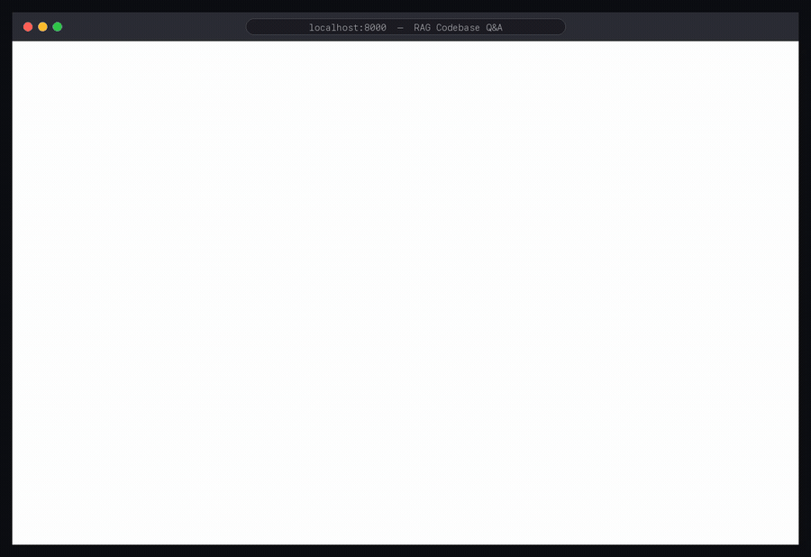

# RAG-Powered Codebase Q&A Assistant

Paste a public GitHub repo, wait a few seconds for indexing, then ask questions in
plain English — "how does the token bucket refill?", "where is send_file
implemented?" — and get answers grounded in the actual code, citing real files and
line numbers instead of hallucinated generalities.



## Run it in one command

Self-hostable, and **no API key required** — embeddings run locally, so you can
index a repo and get cited retrieval results with nothing but Docker installed:

```bash
git clone https://github.com/Shreyash021104/rag-codebase-qa
cd rag-codebase-qa
docker compose up          # Postgres+pgvector and the app, wired together
# open http://localhost:8000
```

The first `docker compose up` builds the image (installs deps, bakes in the embedding
model) — a few minutes; after that it's instant. Want synthesized prose answers on
top of the retrieved code? Set a free [Groq](https://console.groq.com) key first:
`export GROQ_API_KEY=...` then `docker compose up`.

Prefer a manual (non-Docker) setup? See [Running locally](#running-locally).

## The problem

LLMs answer questions about code fluently and are routinely wrong about *your* code
— they answer from training-data averages, not from the repository in front of you.
Retrieval-Augmented Generation (RAG) fixes this by finding the actually-relevant
code first and forcing the model to answer only from it. The catch: RAG quality is
bottlenecked by retrieval quality, and code breaks the standard RAG playbook in two
specific ways this project is built around:

1. **Naive chunking poisons embeddings.** Split files into fixed-size windows and
   you routinely cut functions in half — an embedding of "the bottom half of one
   function plus the top of the next" represents neither, so queries about either
   match it poorly.
2. **Embeddings are bad at exact identifiers.** A query for `markPresent` embeds
   similarly to lots of presence-related code — semantic similarity is exactly the
   wrong tool for "find this specific name."

## Architecture

```
 GitHub URL
     │
     ▼
 Clone (--depth 1) ──▶ Walk files ──▶ AST-aware chunking ──▶ Embed locally ──▶ pgvector
                       (skip deps,     (tree-sitter: one       (bge-small,       (HNSW index,
                        binaries,       chunk per function/     384-dim, runs     one row per
                        >512KB)         class, symbol name      on this           chunk with
                                        attached; loose         machine, no      file/line/
                                        statements grouped;     API, no cost)     symbol)
                                        text fallback for
                                        docs/configs)

 Question ──▶ embed query ──▶ pgvector top-20 ──┐
         └──▶ code-aware BM25 top-20 ───────────┼──▶ reciprocal rank fusion ──▶ top 8
              (markPresent → markpresent,       │
               mark, present)                   ▼
                                     LLM (Claude or Groq/Llama),
                                     strictly grounded:
                                     "answer ONLY from these excerpts,
                                      cite (file:line) as you go"
                                     — or, with no API key configured,
                                     return the excerpts themselves
```

## Tech stack

| Layer | Choice |
|---|---|
| Ingestion/chunking | Python, tree-sitter (`tree-sitter-language-pack`, 20+ languages) |
| Embeddings | `BAAI/bge-small-en-v1.5` via sentence-transformers (default: local, free, no key, 384-dim) — pluggable to Google Gemini (768-dim, hosted) |
| Vector store | Postgres + pgvector (HNSW, cosine) — no extra moving part beyond the DB |
| Keyword leg | BM25 (`rank-bm25`) with code-aware tokenization, fused via RRF |
| LLM | Claude *or* Groq (Llama) — pluggable, auto-detected from configured key; strictly grounded prompting with mandatory citations; optional at runtime |
| API/frontend | FastAPI + a single static page (no build step) |

## The hardest decisions

### 1. Chunk along the code's own boundaries — and the wrapper-node bug

The chunker parses every file with tree-sitter and cuts at declared boundaries: one
chunk per top-level function/class (symbol name attached), consecutive small
statements (imports, constants) grouped, oversized definitions split with the symbol
kept on every piece, and a plain-window fallback for anything unparseable (READMEs,
configs — which answer a lot of real questions and would be silly to skip).

The real bug this surfaced: my first version treated a node as a "definition" by
inspecting its type (`function_definition`, `class_declaration`, ...). Testing
against a real TypeScript file from another of my projects showed every *exported*
symbol coming out as anonymous blob chunks — `export class Room` parses as an
`export_statement` *wrapping* the class declaration, and the wrapper's type matches
nothing. One level of unwrapping fixed it, and the before/after is stark: the same
file went from "one 3,600-character chunk called `None`" to named chunks for `Room`,
`RoomRegistry`, `RoomConnection`. If you've ever wondered why RAG-over-code demos
often feel worse on TypeScript than Python, this class of bug is a decent guess.

### 2. Hybrid retrieval, because embeddings and keyword search fail in opposite ways

Embeddings handle paraphrase ("how do clients get identified?") and miss exact
identifiers; BM25 nails identifiers and misses paraphrase. This project runs both —
pgvector top-20 and BM25 top-20 — and fuses with **reciprocal rank fusion**, which
combines rankings using only each result's *position* in each list. That sidesteps
the ugly problem score-based fusion has: cosine similarities and BM25 scores live on
completely different, incomparable scales, and any weighting between them is a magic
number you'd have to tune. RRF has one well-studied constant (k=60) and no tuning.

Two code-specific details that matter more than they look:
- **BM25 tokenization splits identifiers**: `markPresent` indexes as `markpresent`
  *and* `mark` + `present`, so partial-name queries still hit, while exact-name
  queries get the strongest match.
- **What gets embedded isn't just the code** — each chunk is prefixed with a header
  line naming its file and symbol. Questions mention names ("where is X defined,"
  "how does room.ts persist state") far more often than they quote code verbatim;
  without the header, that signal never reaches the embedding at all.

### 3. Local embeddings, and the LLM as the optional last step — not a load-bearing one

Embeddings are pluggable via `EMBEDDING_PROVIDER`: **local** (bge-small via
sentence-transformers — zero cost, no key, no quota, and the whole pipeline is
testable with no external dependency; the default, and what you get on a fresh clone)
or **gemini** (Google's hosted embedding API — no torch, so it fits tiny free hosting
tiers). The LLM call for answer synthesis is likewise the *last, optional* step and
provider-agnostic (Claude or Groq): with no key configured at all, the API returns
the retrieved excerpts with citations instead of prose — degraded, not broken. That
mirrors how the system actually fails in production: if retrieval is good, the raw
excerpts are still useful; if retrieval is bad, no LLM can save the answer anyway.

Having the eval set (below) made the provider choice a measured decision rather than a
guess — Gemini embeddings scored higher than local bge-small on the same 15 questions
(top-1 80% vs 60%), which is exactly the "is this upgrade worth it" question the
harness exists to answer. But local is the **default** on purpose: Gemini's free tier
is rate- *and* daily-quota-limited (indexing throttles into sub-batches with backoff
in `app/embeddings.py`, and heavy re-indexing can exhaust the daily cap), so for an
open-source project where anyone clones and indexes repos, the zero-dependency local
path is the robust choice. Pick Gemini deliberately when you want its accuracy and
have quota to spare.

### 4. Measure retrieval, don't vibe-check it

`scripts/eval.py` holds 15 hand-labeled questions about a repo I know intimately
(the [rate limiter gateway](https://github.com/Shreyash021104/distributed-rate-limiter-gateway)
— labeled by reading the code, not generated). The metric is top-k retrieval
accuracy: did an expected file appear in the top k chunks?

Measured results, both embedding providers:

| metric | local (bge-small, default) | Gemini (optional) |
|---|---|---|
| top-1 accuracy | 9/15 (60%) | 12/15 (80%) |
| top-3 accuracy | 13/15 (87%) | **15/15 (100%)** |
| top-5 accuracy | 15/15 (100%) | 15/15 (100%) |

Also verified against a real third-party codebase (Flask, 954 chunks, indexed in
~24s locally): "how does `app.route` register a view function?" correctly surfaces
the `Scaffold` class where the decorator actually lives; "where is `send_file`
implemented?" puts the implementation in the top 3.

## Running locally

Requires Postgres with pgvector, and git. No API keys needed for everything except
answer synthesis.

```bash
# Postgres + pgvector (macOS/Homebrew; pgvector needs to match your PG version —
# built from source here since the brew formula targets newer PG):
brew install postgresql@16 && brew services start postgresql@16
git clone --branch v0.8.0 https://github.com/pgvector/pgvector /tmp/pgvector
make -C /tmp/pgvector install PG_CONFIG=/opt/homebrew/opt/postgresql@16/bin/pg_config
createdb rag_codebase

# App
python3 -m venv .venv
.venv/bin/pip install -r requirements.txt
cp .env.example .env               # optional: add GROQ_API_KEY (free) for prose answers
.venv/bin/uvicorn app.main:app     # http://localhost:8000
```

That's the whole setup — **no API keys required** to index a repo and get cited
retrieval results, because embeddings run locally by default. A free Groq (or
Anthropic) key just upgrades the raw excerpts into a synthesized prose answer.

First indexing run downloads the embedding model (~130MB, one time, cached).

```bash
# Run the tests (chunker correctness; schema test runs if DATABASE_URL is set):
.venv/bin/python -m pytest

# Reproduce the eval (index the labeled repo first via the UI or API, note its id):
.venv/bin/python -m scripts.eval <repo_id>
```

## What I'd change at 10x scale

- **BM25 lives in process memory**, rebuilt per repo per process. Fine for one
  instance and portfolio-scale repos; multi-instance or monorepo scale moves this
  into Postgres full-text search (`tsvector` + GIN) so both retrieval legs live in
  the same store the vectors do.
- **Re-indexing is wholesale** (delete + rebuild). Incremental indexing — re-chunk
  only files whose git blob hash changed — is the obvious next step and the schema
  already stores everything needed to diff.
- **No cross-encoder re-ranking.** The standard quality ladder after hybrid
  retrieval is re-ranking the top ~50 with a small cross-encoder model; the eval
  harness exists precisely to measure whether that's worth the latency here.
- **Answers aren't streamed** — for long syntheses, streaming the Claude response
  would cut perceived latency substantially.

## License

MIT
